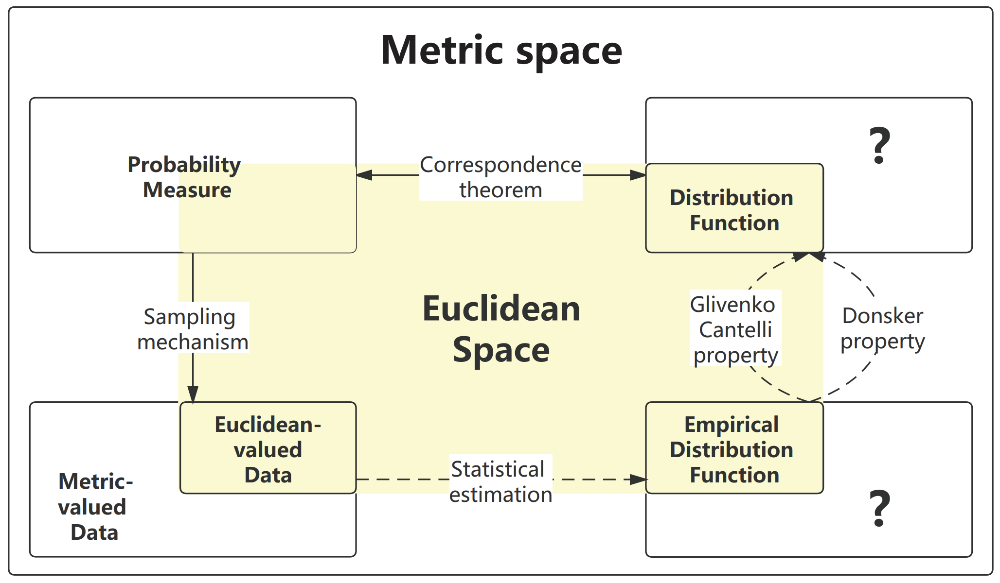

# Reproducible materials
This repository contains scripts to run the simulation described in [Nonparametric Statistical Inference via Metric Distribution Function in Metric Spaces](https://arxiv.org/abs/2107.07317). 



## Codes


## Citations

Please cite the following publications if you make use of the material here.

- Xueqin Wang, Jin Zhu, Wenliang Pan, Junzhu Zhu, and Heping Zhang (JASA, 2023+). Nonparametric statistical inference via metric distribution function in metric spaces. arXiv preprint arXiv:2107.07317.

The corresponding BibteX entries:

```
@article{wang2023nonparametric,
  title={Nonparametric statistical inference via metric distribution function in metric spaces},
  author={Wang, Xueqin and Zhu, Jin and Pan, Wenliang and Zhu, Junhao and Zhang, Heping},
  journal={Journal of American Statistical Association},
  year={2023+}
}

```


## Contact
Please direct questions and comments to the [issues page](https://github.com/Mamba413/Nonparametric-Statistical-Inference-via-Metric-Distribution-Function-in-Metric-Spaces).
